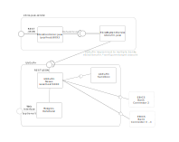

# Use of Libfineu Sandbox

## Libeufin

Based on [Libeufin](https://docs.taler.net/libeufin/index.html) you can add a
stub for a bank backend.

Libeufin is an early project but tested with several German banks. We use two
components:

- Sandbox: The sandbox simulates the bank - or better expresses: the Ebics API of a bank.
- Nexus: This software connects to the API of the bank - can also be used without
the sandbox with a real bank.

Now you can use the ebics-java-service to trigger transaction which are reflected
in the bank statements you can retrieve with the ebics-java-service.

## Architecture Blueprint Sandbox and Libeufin

To run the Sandbox environment, three runtimes are needed:

- Nexus: Connects to the banking API and offers a management interface
- Sandbox: Fakes a banking backend - generates Camt files and interprets Pain files
- Postgres: Database for Nexus

In contrast the the command line client, Nexus can connect to multiple bank accounts.
Note that the ebics-java-service only wraps ONE account and can not deal with several accounts
in the backend.



## Notes on the balance of the account

The sandbox is not able to keep balances, so this is done in
ebics-java-client. But after a restart of the service, the balance is reset
to the value configured (default: 0) in the  environment `ACCOUNT_BALANCE`
or in the `application-sandbox.yml` config file.

## Docker

### Start the backend

Get latest images:

```console
 docker-compose -f docker-compose-sandbox.yml pull
``` 

In the project root of ebics-java-service:

```console
 docker-compose -f docker-compose-sandbox.yml up
```

After start, you should be able to open
[Swagger](http://localhost:8093/ebics/swagger-ui/?url=/ebics/v2/api-docs/#/ebics-controller/getPaymentsUsingGET)
and get the latest bank statements. Expect `[]` to be the result if you did
not make any transactions. Also you my log into [Nexus](http://localhost:3000/home) with foo/superpassword to
see transactions initiated via the API.

### Change the setup of bank accounts

Change the setup script `./scripts/init_libeuin_sandbox.sh` according to the documentation of libeufin.

Purge the backend and restart from scratch using using latest images called from the project-root:

```console
 git pull
 docker-compose -f docker-compose-sandbox.yml stop
 docker-compose -f docker-compose-sandbox.yml rm
 docker-compose -f docker-compose-sandbox.yml pull
 docker-compose -f docker-compose-sandbox.yml up
```

## Useful Curl statements

Set environment variables:

```console
 export LIBEUFIN_NEXUS_URL=http://localhost:5000
 export LIBEUFIN_NEXUS_USERNAME=foo
 export LIBEUFIN_NEXUS_PASSWORD=superpassword
 export LIBEUFIN_SANDBOX_URL=http://localhost:5016
 export CONNECTION_NAME=testconnection
 export SECRET=backupsecret
 export BACKUP_FILE=/app/backupfile
 export LOCAL_ACCOUNT_NAME=peggingaccount
 export EBICS_USER_ID=e36
 export EBICS_HOST_ID=testhost
 export EBICS_PARTNER_ID=e36
 export LIBEUFIN_NEXUS_USERNAME=foo
 export LIBEUFIN_NEXUS_PASSWORD=superpassword
 ```

Get Camt.053 message directly from the sandbox:

```console
 curl -d '{"iban":"DE18500105172929531881","type":53}' -H "Content-Type: application/json"  \
  -X POST $LIBEUFIN_SANDBOX_URL/admin/payments/camt
```

List connected bank accounts:

```console
 curl -u $LIBEUFIN_NEXUS_USERNAME:$LIBEUFIN_NEXUS_PASSWORD \
  $LIBEUFIN_NEXUS_URL/bank-accounts
```

Trigger transactions directly with the Nexus-API:

```console
 curl -X POST -u $LIBEUFIN_NEXUS_USERNAME:$LIBEUFIN_NEXUS_PASSWORD \
 -d '{"iban":"CH1230116000289537312","bic":"HYPLCH22571","name":"test name","subject":"testsubject is here","amount":"EUR:12.21"}' -H "Content-Type: application/json" -X POST \
  $LIBEUFIN_NEXUS_URL/bank-accounts/CH1230116000289537320/payment-initiations 

 curl -X POST -u $LIBEUFIN_NEXUS_USERNAME:$LIBEUFIN_NEXUS_PASSWORD \
   $LIBEUFIN_NEXUS_URL/bank-accounts/CH1230116000289537320/payment-initiations/1/submit

 curl -X POST -u $LIBEUFIN_NEXUS_USERNAME:$LIBEUFIN_NEXUS_PASSWORD \
 -d '{"iban":"CH1230116000289537320","bic":"HYPLCH22571","name":"test name","subject":"testsubject is here","amount":"EUR:12.21"}' -H "Content-Type: application/json" -X POST \
  $LIBEUFIN_NEXUS_URL/bank-accounts/CH1230116000289537312/payment-initiations 

 curl -X POST -u $LIBEUFIN_NEXUS_USERNAME:$LIBEUFIN_NEXUS_PASSWORD \
   $LIBEUFIN_NEXUS_URL/bank-accounts/CH1230116000289537312/payment-initiations/2/submit
```

Read transactions from the Nexus API - first you need to fetch them,
then you can show transactions:

```console
 curl -X POST -u $LIBEUFIN_NEXUS_USERNAME:$LIBEUFIN_NEXUS_PASSWORD \
  $LIBEUFIN_NEXUS_URL/bank-accounts/CH2108307000289537320/fetch-transactions

 curl -u $LIBEUFIN_NEXUS_USERNAME:$LIBEUFIN_NEXUS_PASSWORD \
  $LIBEUFIN_NEXUS_URL/bank-accounts/CH2108307000289537320/transactions
```
